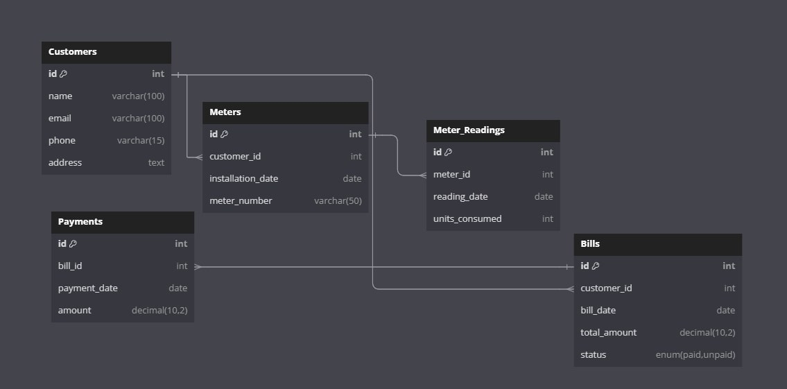

# Electric Billing System Database

By **Reddysai Jonnadula**

Video overview: <[URL HERE](https://dai.ly/k2miJ6KO2xIKooBG6EC)>

---

## Scope

### Purpose of the Database

The purpose of this database is to manage an electric billing system, specifically to store, retrieve, and update information related to customers, meters, meter readings, bills, and payments. The system automates bill generation based on meter readings, tracks unpaid bills, and records payments made by customers. It helps the electric company maintain an accurate record of all transactions and efficiently manage unpaid bills.

### Included in the Scope

1. **Customers**: Storing customer details like name, email, phone, and address.
2. **Meters**: Details of meters associated with each customer, including installation dates.
3. **Meter Readings**: Record of meter readings and the number of units consumed by each customer.
4. **Bills**: Information about generated bills, total amount, and payment status.
5. **Payments**: Records of payments made by customers towards their bills.
6. **Unpaid Bills**: A view to track bills that are still unpaid.

### Outside the Scope

1. **Detailed usage history**: The database does not track detailed usage beyond units consumed.
2. **Rate adjustments**: The system assumes a fixed rate for bill calculation and does not support variable rates based on time of use.
3. **Customer credit history**: There is no mechanism for tracking or assessing customer creditworthiness.

---

## Functional Requirements

### What a User Should Be Able to Do

1. **Create new customers**: Users can insert customer details.
2. **Assign meters to customers**: Users can associate meters with customers.
3. **Record meter readings**: Users can insert new meter readings to track consumption.
4. **Generate bills**: Automatically generate bills based on meter readings.
5. **Make payments**: Users can log payments made by customers.
6. **View unpaid bills**: Users can view all unpaid bills.
7. **Update customer details**: Users can update contact information like phone and email.
8. **Delete customers**: Users can delete customers, and associated records will cascade.

### Beyond the Scope

1. **Adjust billing rates dynamically**: The system does not support changing rates based on consumption levels or time of day.
2. **Advanced customer analytics**: The system does not include detailed analysis of consumption trends or payment behaviors.
3. **Online payment integration**: The database does not handle real-time payment systems or gateways.

---

## Representation

### Entities

1. **Customers**
   - **Attributes**: `id` (INT, PRIMARY KEY), `name` (VARCHAR), `email` (VARCHAR), `phone` (VARCHAR), `address` (TEXT)
   - **Why**: Customers are key entities that need to be uniquely identified and have contact details stored for billing and communication.
   - **Constraints**: Unique email addresses and auto-incrementing IDs for easy reference.

2. **Meters**
   - **Attributes**: `id` (INT, PRIMARY KEY), `customer_id` (INT, FOREIGN KEY), `installation_date` (DATE), `meter_number` (VARCHAR)
   - **Why**: Each customer is assigned a meter, which must be uniquely identified.
   - **Constraints**: Meters are linked to a specific customer, ensuring the correct billing.

3. **Meter_Readings**
   - **Attributes**: `id` (INT, PRIMARY KEY), `meter_id` (INT, FOREIGN KEY), `reading_date` (DATE), `units_consumed` (INT)
   - **Why**: These track usage for each meter over time.
   - **Constraints**: Foreign key to meters ensures correct mapping to customers.

4. **Bills**
   - **Attributes**: `id` (INT, PRIMARY KEY), `customer_id` (INT, FOREIGN KEY), `bill_date` (DATE), `total_amount` (DECIMAL), `status` (ENUM 'paid', 'unpaid')
   - **Why**: Bills record the amount owed by customers based on their consumption.
   - **Constraints**: Auto-generated after meter readings, must be linked to a customer.

5. **Payments**
   - **Attributes**: `id` (INT, PRIMARY KEY), `bill_id` (INT, FOREIGN KEY), `payment_date` (DATE), `amount` (DECIMAL)
   - **Why**: Payments reflect transactions made by customers toward their bills.
   - **Constraints**: Linked to a bill to ensure accurate recording of payments.

### Relationships

- **Customer to Meters**: One-to-many relationship (each customer can have multiple meters).
- **Meter to Meter_Readings**: One-to-many relationship (each meter can have multiple readings).
- **Customer to Bills**: One-to-many relationship (each customer can have multiple bills).
- **Bill to Payments**: One-to-many relationship (each bill can have multiple payments).

---

## Optimizations

1. **Indexes**:
   - `idx_email` on the `Customers` table for faster lookup of customer information by email.
   - `idx_meter_customer_id` on the `Meters` table for faster access to meters based on customer ID.
   - `idx_reading_meter_id` on the `Meter_Readings` table for efficient querying of meter readings by meter ID.
   - `idx_bill_customer_id` on the `Bills` table to quickly find all bills associated with a customer.
   - `idx_payment_bill_id` on the `Payments` table for fast access to payments based on bill ID.

2. **Views**:
   - `UnpaidBills`: A view to quickly access all unpaid bills without having to perform complex joins or filtering on the fly.

### Why:
Indexes improve the performance of queries on large tables, especially when searching by foreign keys or unique columns. The `UnpaidBills` view simplifies access to commonly needed data, reducing complexity for users and ensuring better readability.

---

## Limitations

1. **Scalability**: While this design works for small to medium-sized electric companies, it may not scale efficiently for large volumes of customers and meters without further optimization (e.g., partitioning or more advanced indexing).
2. **Fixed Rate Calculation**: The system uses a fixed rate (`0.10` per unit) for bill generation. If rates change frequently or vary by customer, additional complexity will need to be added to the billing logic.
3. **Real-Time Data**: The database is not optimized for real-time data integration from smart meters, which would require a more dynamic system capable of handling frequent updates and potentially larger datasets.
